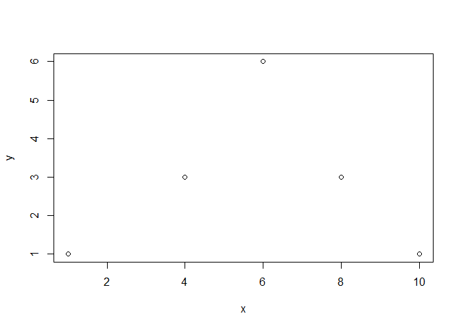
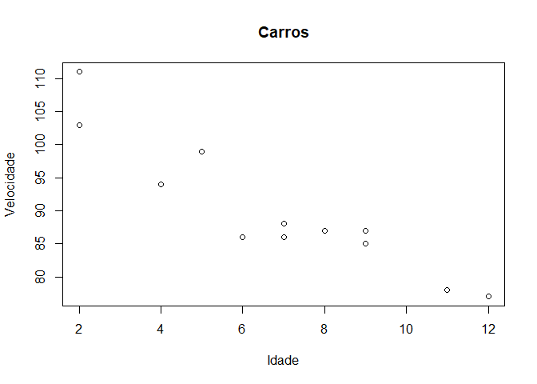

Plotting em R
================
Luiz Carlos Vieira
22/02/2022

# Introdução

A função plot () é usada para desenhar pontos (marcadores) em um
diagrama.

A função usa parâmetros para especificar pontos no diagrama: O parâmetro
1 especifica pontos no eixo x. O parâmetro 2 especifica pontos no eixo
y.

Em sua forma mais simples, você pode usar a função plot() para
representar graficamente dois números um contra o outro.

# Exemplos

Desenhar um ponto em um diagrama na posição(1) e na posição (3):

``` r
plot(2, 3)
```

<!-- -->

Múltiplos pontos usando vetores

``` r
plot(c(1, 3, 5, 7), c(2, 4, 6, 8))
```

<!-- -->

Por questões de organização, é melhor armazenar múltiplos valores em
variáveis, e depois atribuí-las ao eixo x e y.

``` r
x <- c(1, 4, 6, 8, 10)
y <- c(1, 3, 6, 3, 1)

plot(x, y)
```

<!-- -->

Plots usando os valores em sequência

``` r
x <- 1:10
y <- seq(from=1, to=20, by=2)
plot(x,y)
```

<!-- -->

## Legendas do gráficos (Plot Labels)

A função plot() aceita outros paramêtros, como main, xlab e ylab.

Onde main = título, xlab e ylab para os labels dos eixos x e y,
respectivamente.

``` r
plot(1:10, main="Um plot em R", xlab=" Eixo-x", ylab="Eixo-y")
```

<!-- -->

# Aparência do gráfico

Existem muitos outros parâmetros que você pode usar para alterar a
aparência dos pontos.

## Cor

Para adicionar uma cor aos pontos: col = “color”’

``` r
plot(1:10, col="red")
```

<!-- -->

## Size

Para mudar o tamanho dos pontos use:

cex= 1 (padrão), cex=0.5 (50% menor) e cex=2 (100% maior)

``` r
plot(1:10, cex=0.5)
```

<!-- -->

``` r
plot(1:10, cex=2)
```

<!-- -->

## Multiplos plots

A função par() permite definir parâmetros para o gráfico. O parâmetro
mfrow() permite dividir a tela em vários painéis.

``` r
par(mfrow=c(1,2))

plot(1:10, cex=0.5)
plot(1:10, cex=2)
```

<!-- -->

# Formato dos pontos

Existem 26 formatos diferentes de pch, representados por valores entre 0
e 25.


Triangulos verdes

``` r
plot(1:10, pch=23, cex=2, col='green')
```

<!-- -->

## Gráficos de Linha

Um gráfico de linha possui uma linha que conecta todos os pontos de um
diagrama.

Para criar uma linha, use a função plot() e adicione o parâmetro de type
com um valor de “l”:

``` r
plot(1:10, type="l")
```

<!-- -->

# Modificando a cor da linha

``` r
plot(1:10, type="l", col="blue")
```

<!-- -->

# Modfificando a espessura da linha:

``` r
plot(1:10, type="l", col='blue', lwd=4)
```

<!-- -->

### Estilos de linha

A linha é sólida por padrão. Use o parâmetro lty com um valor de 0 a 6
para especificar o formato da linha.

Por exemplo, lty = 3 exibirá uma linha pontilhada em vez de uma linha
sólida:

``` r
par(mfrow=c(1,2))
plot(1:10, type="l", col='yellow', lwd=5, lty=3)
plot(1:10, type="l", col='green', lwd=5, lty=5)
```

<!-- -->

Valores de parâmetro disponíveis para lty:

-   0 remove a linha
-   1 exibe uma linha sólida
-   2 exibe uma linha tracejada
-   3 exibe uma linha pontilhada
-   4 exibe uma linha “pontilhada”
-   5 exibe uma linha “longa tracejada”
-   6 exibe uma linha “dois tracejados” ’

## Múltiplas Linhas

Para exibir mais de uma linha em um gráfico, use a função plot () junto
com a função lines ():

``` r
line1 <- c(1,2,3,4,5,6)
line2 <- c(1,3,4,5,6,7)
line3 <- c(1,4,5,6,7,8)
line4 <- c(1,5,6,7,8,9)

plot(line1, type = "l", col = "blue", main = 'Multi Line Graph')
lines(line2, type="l", col = "red")
lines(line3, type="l", col = "green")
lines(line4, type="l", col = "black")
```

<!-- -->

# Gráficos de dispersão / scatter plot

Um “gráfico de dispersão” é um tipo de gráfico usado para exibir a
relação entre duas variáveis numéricas e plotar um ponto para cada
observação.

Necessita de dois vetores de mesmo comprimento, um para o eixo x
(horizontal) e outro para o eixo y (vertical):

``` r
#Criando vetores, vamos supor idade do carro x velocidade
x <- c(5,7,8,7,2,2,9,4,11,12,9,6)
y <- c(99,86,87,88,111,103,87,94,78,77,85,86)

plot(x, y, main="Carros", xlab="Idade", ylab="Velocidade")
```

<!-- -->

## Comparar gráficos

No exemplo acima, parece haver uma relação entre a velocidade do carro e
a idade, mas e se traçarmos as observações de outro dia também? O
gráfico de dispersão nos dirá mais alguma coisa?

Para comparar o gráfico com outro gráfico, use a função points ():

# Dia 1, idade e velocidade de 10 carros

``` r
x1 <- c(5,7,8,7,2,2,9,4,11,12)
y1 <- c(99,86,87,88,111,103,87,94,78,77)
```

# Dia 2, idade e velocidade de 10 carros

``` r
x2 <- c(2,2,8,1,15,8,12,9,7,3)
y2 <- c(100,105,84,105,90,99,90,95,94,100)
```

``` r
plot(x1, y1, main="Carros em dias diferentes", xlab="Idade", ylab="Velocidade", col="red", cex=1)

points(x2, y2, col="blue", cex=2)
abline()
```

<!-- -->

# Gráficos de pizza

Um gráfico de pizza é uma exibição gráfica circular de dados.

Use a função pie() para desenhar gráficos de pizza:

Criando um vetor para exemplificar os gráficos de pizza

``` r
x <- c(10,20,30,40)
pie(x)
```

<!-- -->

Por padrão, a plotagem da primeira pizza começa no eixo x e se move no
sentido anti-horário.

O tamanho de cada fatia pode ser definido por x/sum(x)’

Definindo o valor de init.angle(ângulo inicial em graus), onde o ângulo
padrão é 0.

``` r
pie(x, init.angle = 90)
```

<!-- -->

# Rótulos e Cabeçalho

Use o parâmetro label para adicionar um rótulo ao gráfico de pizza e use
o parâmetro principal para adicionar um cabeçalho:

vetor de labels(ou rótulos)

``` r
label <- c("aaa", "bbb", "ccc", "ddd")

pie(x, label = label, main = "Letras")
```

<!-- -->

# Cores

Adicionar uma cor a cada pizza com o parâmetro col:

vector de colores

``` r
colors <- c("blue", "yellow", "green", "black")

pie(x, label = label, main = "letras", col = colors)
```

<!-- -->

## Lengenda

Para adicionar uma lista de explicação para cada pizza, use a função
legend ():

Adicionando uma caixa com as legenda

``` r
pie(x, label = label, main = "Fruits", col = colors)
legend("bottomleft", label, fill = colors)
```

<!-- -->

Possíveis posições da legenda:

bottomright, bottom, bottomleft, left, topleft, top, topright, right,
center ’

# Gráficos de barra

Um gráfico de barras usa barras retangulares para visualizar os dados.
Os gráficos de barras podem ser exibidos horizontal ou verticalmente.

A altura ou comprimento das barras são proporcionais aos valores que
representam.

Use a função barplot() para desenhar um gráfico de barras verticais:

``` r
# x-axis values
x <- c("A", "B", "C", "D")

# y-axis values
y <- c(2, 4, 6, 8)

barplot(y, names.arg = x)
```

<!-- -->

Explicando o exemplo:

A variável x representa valores no eixo x (A, B, C, D) A variável y
representa valores no eixo y (2,4,6,8) Em seguida, usamos a função
barplot () para criar um gráfico de barras dos valores names.arg define
os nomes de cada observação no eixo x

## Alterando cores

``` r
x <- c("A", "B", "C", "D")
y <- c(2, 4, 6, 8)

barplot(y, names.arg = x, col = "red")
```

<!-- -->

## Alterando densidade ou textura

``` r
x <- c("A", "B", "C", "D")
y <- c(2, 4, 6, 8)

barplot(y, names.arg = x, density = 10)
```

<!-- -->

## Alterando largura das colunas

``` r
x <- c("A", "B", "C", "D")
y <- c(2, 4, 6, 8)

barplot(y, names.arg = x, width = c(1,2,3,4))
```

<!-- -->

## Gráfico de barras horizontal

``` r
x <- c("A", "B", "C", "D")
y <- c(2, 4, 6, 8)

barplot(y, names.arg = x, horiz = TRUE)
```

<!-- -->

## Referências:

<https://www.w3schools.com/r/default.asp>
<https://www.cs.upc.edu/~robert/teaching/estadistica/rprogramming.pdf>
