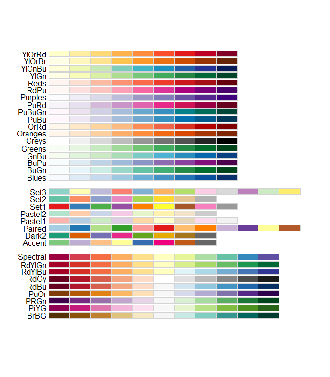
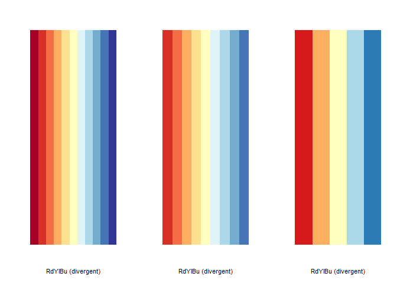
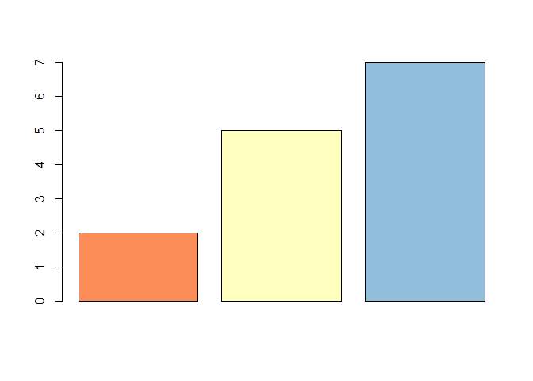
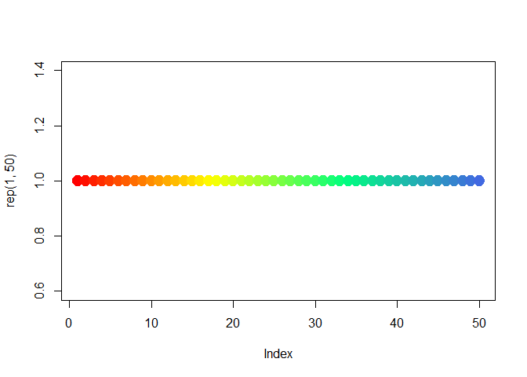
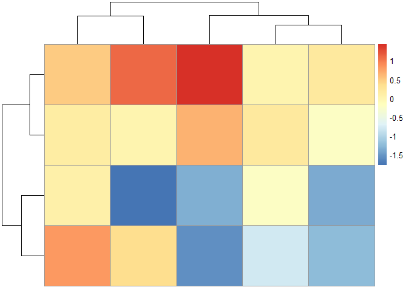

RColorBrewer palettes
================
Luiz Carlos Vieira
22/02/2022

# Introdução

colorRampPalette() pode ser entendido como um “misturador” de cores.

Imagine que você tem uma paleta de cores, e esta possue apenas as cores
vermelho e azul. A função colorRampPalette() cria um espectro de
diferentes cores misturando o azul e o vermelho.

Instalação do pacote RColorBrewer:

``` r
#install.packages("RColorBrewer")

# Carregando a bibioteca
library(RColorBrewer)
```

Acessando as paletas de cores do biblioteca RColorBrewer com a função
display.brewer.all()

``` r
display.brewer.all()
```

<!-- -->

# Há 3 tipos de paletas: sequential, diverging e qualitative.

## As paletas sequenciais

são adequadas para dados ordenados que progridem de baixo para alto
(gradiente).

As paletass são: Blues, BuGn, BuPu, GnBu, Greens, Greys, Oranges, OrRd,
PuBu, PuBuGn, PuRd, Purples, RdPu, Reds, YlGn, YlGnBu YlOrBr, YlOrRd.

## As paletas divergentes

colocam a mesma ênfase em valores críticos de médio alcance e extremos
em ambas as extremidades do intervalo de dados.

As paletass são: BrBG, PiYG, PRGn, PuOr, RdBu, RdGy, RdYlBu, RdYlGn,
Spectral

## As paletas qualitativas

são mais adequadas para representar dados nominais ou categóricos. Não
implicam diferenças de magnitude entre os grupos.

As paletass são: Accent, Dark2, Paired, Pastel1, Pastel2, Set1, Set2,
Set3

# Para visualizar apenas uma paleta RColorBrewer, basta especificar o nome da cor:

``` r
par(mfrow=c(1,3))
display.brewer.pal(n = 11, name = 'RdYlBu')
display.brewer.pal(n = 9, name = 'RdYlBu')
display.brewer.pal(n = 5, name = 'RdYlBu')
```

<!-- -->

# Hexadecimal color specification

``` r
brewer.pal(n = 8, name = "RdBu")
```

    ## [1] "#B2182B" "#D6604D" "#F4A582" "#FDDBC7" "#D1E5F0" "#92C5DE" "#4393C3"
    ## [8] "#2166AC"

# Barplot usando RColorBrewer

``` r
barplot(c(2,5,7), col=brewer.pal(n = 3, name = "RdYlBu"))
```

<!-- -->

## Função brewer.pal()

A única função real no pacote RColorBrewer é a função brewer.pal() que
tem dois argumentos

name: o nome da paleta de cores que você deseja usar n: o número de
cores que você deseja da paleta (inteiro)

Abaixo optamos por utilizar 3 cores da paleta “BuGn”, que é uma paleta
sequencial.

``` r
cols <- brewer.pal(3, "BuGn")
cols
```

    ## [1] "#E5F5F9" "#99D8C9" "#2CA25F"

## Palleta de cores com a função colorRampPalette

A função colorRampPalette() retorna uma função contendo as cores que
interpolam a paleta.

As cores da qual se deseja criar apaleta são informadadas como
argumentos para a função, e esta retorna uma outra função com as cores,
que podem ser acessadas informando a quantidade de cores que se deseja
acessar.

``` r
colfunc <- colorRampPalette(c("green", "yellow", "red"))
colfunc(4)
```

    ## [1] "#00FF00" "#AAFF00" "#FFAA00" "#FF0000"

## Outro exemplo

``` r
colfunc <- colorRampPalette(c("red","yellow","springgreen","royalblue"))

plot(rep(1,50), col=(colfunc(50)), pch=19, cex=2)
```

<!-- -->

## colorRampPalette e brewer.pal

Criando uma paleta com 100 cores, baseadas nas 9 cores da oaleta
‘Blues’.

``` r
colorRampPalette(brewer.pal(9,'Blues'))(100)
```

    ##   [1] "#F7FBFF" "#F4F9FE" "#F2F8FD" "#F0F7FD" "#EEF5FC" "#ECF4FB" "#EAF3FB"
    ##   [8] "#E8F1FA" "#E6F0F9" "#E4EFF9" "#E2EEF8" "#E0ECF7" "#DEEBF7" "#DCEAF6"
    ##  [15] "#DAE8F5" "#D8E7F5" "#D6E6F4" "#D5E5F4" "#D3E3F3" "#D1E2F2" "#CFE1F2"
    ##  [22] "#CDDFF1" "#CBDEF0" "#C9DDF0" "#C7DBEF" "#C5DAEE" "#C1D9ED" "#BED7EC"
    ##  [29] "#BBD6EB" "#B8D5EA" "#B5D3E9" "#B1D2E7" "#AED1E6" "#ABCFE5" "#A8CEE4"
    ##  [36] "#A4CCE3" "#A1CBE2" "#9ECAE1" "#9AC8E0" "#96C5DF" "#92C3DE" "#8EC1DD"
    ##  [43] "#89BEDC" "#85BCDB" "#81BADA" "#7DB8DA" "#79B5D9" "#75B3D8" "#71B1D7"
    ##  [50] "#6DAFD6" "#69ACD5" "#66AAD4" "#62A8D2" "#5FA6D1" "#5CA3D0" "#58A1CE"
    ##  [57] "#559FCD" "#529DCC" "#4E9ACB" "#4B98C9" "#4896C8" "#4493C7" "#4191C5"
    ##  [64] "#3E8EC4" "#3C8CC3" "#3989C1" "#3686C0" "#3484BE" "#3181BD" "#2E7EBC"
    ##  [71] "#2C7CBA" "#2979B9" "#2776B8" "#2474B6" "#2171B5" "#1F6FB3" "#1D6CB1"
    ##  [78] "#1B69AF" "#1967AD" "#1764AB" "#1562A9" "#135FA7" "#115CA5" "#0F5AA3"
    ##  [85] "#0D57A1" "#0B559F" "#09529D" "#084F9A" "#084D96" "#084A92" "#08478E"
    ##  [92] "#08458A" "#084286" "#083F82" "#083D7E" "#083A7A" "#083776" "#083572"
    ##  [99] "#08326E" "#08306B"

## Revertendo a paleta de cores

A função rev, reverte a ordem das cores

O argumento colors também funciona na função pheatmap.

``` r
library(pheatmap)

mat <- matrix(rnorm(20), ncol = 5, nrow = 4) 

corBlues <- colorRampPalette(rev(brewer.pal(9, "Blues")))(255)

pheatmap(mat, colors = corBlues) 
```

<!-- -->

## Referências:

<https://www.w3schools.com/r/default.asp>
<https://www.cs.upc.edu/~robert/teaching/estadistica/rprogramming.pdf>
<https://bookdown.org/rdpeng/exdata/plotting-and-color-in-r.html#colorramp>
