Análise de dados em R
================
Luiz Carlos Vieira
22/02/2022

# Introdução

Laboratórios por todo o mundo estão sequenciando os genomas das mais
diversas formas de vida na Terra. Porém mesmo com custos decrescendo
rapidamente e enormes avanços tecnológicos no sequenciamento do genoma,
estamos vendo apenas um pequena parcela das informações biológicas
contidas em cada célula, tecido, organismo e ecossistema.

No entanto, esta “pequena parcela” das informações biológicas que
estamos coletando equivalem a montanhas de dados com os quais os
biólogos precisam trabalhar. Em nenhum outro momento da história da
humanidade nossa capacidade de entender as complexidades da vida
dependeu tanto de nossas habilidades para trabalhar e analisar dados. E
todo esse esforço em pesquisa precisa ser robusto e reproduzível.

Com isso, ferramentas que nos ajudem a analisar esses dados de forma
eficiente, rápida, e fidedigna são essenciais para garantir produção e
reprodutibilidade das pesquisas. A exemplo destas ferramentas, temos as
linguagem de programação R e python que possibilitam a manipulação de
grande volume de dados.

## Carregando a biblioteca built-in MASS

``` r
library(MASS)
```

## Informações sobre o dataset

Visualizando o cabeçalho e rodapé do dataset cars93

``` r
head(Cars93)  
```

    ##   Manufacturer   Model    Type Min.Price Price Max.Price MPG.city MPG.highway
    ## 1        Acura Integra   Small      12.9  15.9      18.8       25          31
    ## 2        Acura  Legend Midsize      29.2  33.9      38.7       18          25
    ## 3         Audi      90 Compact      25.9  29.1      32.3       20          26
    ## 4         Audi     100 Midsize      30.8  37.7      44.6       19          26
    ## 5          BMW    535i Midsize      23.7  30.0      36.2       22          30
    ## 6        Buick Century Midsize      14.2  15.7      17.3       22          31
    ##              AirBags DriveTrain Cylinders EngineSize Horsepower  RPM
    ## 1               None      Front         4        1.8        140 6300
    ## 2 Driver & Passenger      Front         6        3.2        200 5500
    ## 3        Driver only      Front         6        2.8        172 5500
    ## 4 Driver & Passenger      Front         6        2.8        172 5500
    ## 5        Driver only       Rear         4        3.5        208 5700
    ## 6        Driver only      Front         4        2.2        110 5200
    ##   Rev.per.mile Man.trans.avail Fuel.tank.capacity Passengers Length Wheelbase
    ## 1         2890             Yes               13.2          5    177       102
    ## 2         2335             Yes               18.0          5    195       115
    ## 3         2280             Yes               16.9          5    180       102
    ## 4         2535             Yes               21.1          6    193       106
    ## 5         2545             Yes               21.1          4    186       109
    ## 6         2565              No               16.4          6    189       105
    ##   Width Turn.circle Rear.seat.room Luggage.room Weight  Origin          Make
    ## 1    68          37           26.5           11   2705 non-USA Acura Integra
    ## 2    71          38           30.0           15   3560 non-USA  Acura Legend
    ## 3    67          37           28.0           14   3375 non-USA       Audi 90
    ## 4    70          37           31.0           17   3405 non-USA      Audi 100
    ## 5    69          39           27.0           13   3640 non-USA      BMW 535i
    ## 6    69          41           28.0           16   2880     USA Buick Century

``` r
tail(Cars93)
```

    ##    Manufacturer   Model    Type Min.Price Price Max.Price MPG.city MPG.highway
    ## 88   Volkswagen     Fox   Small       8.7   9.1       9.5       25          33
    ## 89   Volkswagen Eurovan     Van      16.6  19.7      22.7       17          21
    ## 90   Volkswagen  Passat Compact      17.6  20.0      22.4       21          30
    ## 91   Volkswagen Corrado  Sporty      22.9  23.3      23.7       18          25
    ## 92        Volvo     240 Compact      21.8  22.7      23.5       21          28
    ## 93        Volvo     850 Midsize      24.8  26.7      28.5       20          28
    ##               AirBags DriveTrain Cylinders EngineSize Horsepower  RPM
    ## 88               None      Front         4        1.8         81 5500
    ## 89               None      Front         5        2.5        109 4500
    ## 90               None      Front         4        2.0        134 5800
    ## 91               None      Front         6        2.8        178 5800
    ## 92        Driver only       Rear         4        2.3        114 5400
    ## 93 Driver & Passenger      Front         5        2.4        168 6200
    ##    Rev.per.mile Man.trans.avail Fuel.tank.capacity Passengers Length Wheelbase
    ## 88         2550             Yes               12.4          4    163        93
    ## 89         2915             Yes               21.1          7    187       115
    ## 90         2685             Yes               18.5          5    180       103
    ## 91         2385             Yes               18.5          4    159        97
    ## 92         2215             Yes               15.8          5    190       104
    ## 93         2310             Yes               19.3          5    184       105
    ##    Width Turn.circle Rear.seat.room Luggage.room Weight  Origin
    ## 88    63          34           26.0           10   2240 non-USA
    ## 89    72          38           34.0           NA   3960 non-USA
    ## 90    67          35           31.5           14   2985 non-USA
    ## 91    66          36           26.0           15   2810 non-USA
    ## 92    67          37           29.5           14   2985 non-USA
    ## 93    69          38           30.0           15   3245 non-USA
    ##                  Make
    ## 88     Volkswagen Fox
    ## 89 Volkswagen Eurovan
    ## 90  Volkswagen Passat
    ## 91 Volkswagen Corrado
    ## 92          Volvo 240
    ## 93          Volvo 850

Visualizando o dataset Cars93 completo com View()

``` r
View(Cars93)
```

Dimenssõeses do dataset Cars93

``` r
dim(Cars93)
```

    ## [1] 93 27

``` r
nrow(Cars93)
```

    ## [1] 93

``` r
ncol(Cars93)
```

    ## [1] 27

Estrutura do dataset

``` r
str(Cars93)
```

    ## 'data.frame':    93 obs. of  27 variables:
    ##  $ Manufacturer      : Factor w/ 32 levels "Acura","Audi",..: 1 1 2 2 3 4 4 4 4 5 ...
    ##  $ Model             : Factor w/ 93 levels "100","190E","240",..: 49 56 9 1 6 24 54 74 73 35 ...
    ##  $ Type              : Factor w/ 6 levels "Compact","Large",..: 4 3 1 3 3 3 2 2 3 2 ...
    ##  $ Min.Price         : num  12.9 29.2 25.9 30.8 23.7 14.2 19.9 22.6 26.3 33 ...
    ##  $ Price             : num  15.9 33.9 29.1 37.7 30 15.7 20.8 23.7 26.3 34.7 ...
    ##  $ Max.Price         : num  18.8 38.7 32.3 44.6 36.2 17.3 21.7 24.9 26.3 36.3 ...
    ##  $ MPG.city          : int  25 18 20 19 22 22 19 16 19 16 ...
    ##  $ MPG.highway       : int  31 25 26 26 30 31 28 25 27 25 ...
    ##  $ AirBags           : Factor w/ 3 levels "Driver & Passenger",..: 3 1 2 1 2 2 2 2 2 2 ...
    ##  $ DriveTrain        : Factor w/ 3 levels "4WD","Front",..: 2 2 2 2 3 2 2 3 2 2 ...
    ##  $ Cylinders         : Factor w/ 6 levels "3","4","5","6",..: 2 4 4 4 2 2 4 4 4 5 ...
    ##  $ EngineSize        : num  1.8 3.2 2.8 2.8 3.5 2.2 3.8 5.7 3.8 4.9 ...
    ##  $ Horsepower        : int  140 200 172 172 208 110 170 180 170 200 ...
    ##  $ RPM               : int  6300 5500 5500 5500 5700 5200 4800 4000 4800 4100 ...
    ##  $ Rev.per.mile      : int  2890 2335 2280 2535 2545 2565 1570 1320 1690 1510 ...
    ##  $ Man.trans.avail   : Factor w/ 2 levels "No","Yes": 2 2 2 2 2 1 1 1 1 1 ...
    ##  $ Fuel.tank.capacity: num  13.2 18 16.9 21.1 21.1 16.4 18 23 18.8 18 ...
    ##  $ Passengers        : int  5 5 5 6 4 6 6 6 5 6 ...
    ##  $ Length            : int  177 195 180 193 186 189 200 216 198 206 ...
    ##  $ Wheelbase         : int  102 115 102 106 109 105 111 116 108 114 ...
    ##  $ Width             : int  68 71 67 70 69 69 74 78 73 73 ...
    ##  $ Turn.circle       : int  37 38 37 37 39 41 42 45 41 43 ...
    ##  $ Rear.seat.room    : num  26.5 30 28 31 27 28 30.5 30.5 26.5 35 ...
    ##  $ Luggage.room      : int  11 15 14 17 13 16 17 21 14 18 ...
    ##  $ Weight            : int  2705 3560 3375 3405 3640 2880 3470 4105 3495 3620 ...
    ##  $ Origin            : Factor w/ 2 levels "USA","non-USA": 2 2 2 2 2 1 1 1 1 1 ...
    ##  $ Make              : Factor w/ 93 levels "Acura Integra",..: 1 2 4 3 5 6 7 9 8 10 ...

Descrição estatística do dataset

``` r
summary(Cars93)
```

    ##     Manufacturer     Model         Type      Min.Price         Price      
    ##  Chevrolet: 8    100    : 1   Compact:16   Min.   : 6.70   Min.   : 7.40  
    ##  Ford     : 8    190E   : 1   Large  :11   1st Qu.:10.80   1st Qu.:12.20  
    ##  Dodge    : 6    240    : 1   Midsize:22   Median :14.70   Median :17.70  
    ##  Mazda    : 5    300E   : 1   Small  :21   Mean   :17.13   Mean   :19.51  
    ##  Pontiac  : 5    323    : 1   Sporty :14   3rd Qu.:20.30   3rd Qu.:23.30  
    ##  Buick    : 4    535i   : 1   Van    : 9   Max.   :45.40   Max.   :61.90  
    ##  (Other)  :57    (Other):87                                               
    ##    Max.Price       MPG.city      MPG.highway                  AirBags  
    ##  Min.   : 7.9   Min.   :15.00   Min.   :20.00   Driver & Passenger:16  
    ##  1st Qu.:14.7   1st Qu.:18.00   1st Qu.:26.00   Driver only       :43  
    ##  Median :19.6   Median :21.00   Median :28.00   None              :34  
    ##  Mean   :21.9   Mean   :22.37   Mean   :29.09                          
    ##  3rd Qu.:25.3   3rd Qu.:25.00   3rd Qu.:31.00                          
    ##  Max.   :80.0   Max.   :46.00   Max.   :50.00                          
    ##                                                                        
    ##  DriveTrain  Cylinders    EngineSize      Horsepower         RPM      
    ##  4WD  :10   3     : 3   Min.   :1.000   Min.   : 55.0   Min.   :3800  
    ##  Front:67   4     :49   1st Qu.:1.800   1st Qu.:103.0   1st Qu.:4800  
    ##  Rear :16   5     : 2   Median :2.400   Median :140.0   Median :5200  
    ##             6     :31   Mean   :2.668   Mean   :143.8   Mean   :5281  
    ##             8     : 7   3rd Qu.:3.300   3rd Qu.:170.0   3rd Qu.:5750  
    ##             rotary: 1   Max.   :5.700   Max.   :300.0   Max.   :6500  
    ##                                                                       
    ##   Rev.per.mile  Man.trans.avail Fuel.tank.capacity   Passengers   
    ##  Min.   :1320   No :32          Min.   : 9.20      Min.   :2.000  
    ##  1st Qu.:1985   Yes:61          1st Qu.:14.50      1st Qu.:4.000  
    ##  Median :2340                   Median :16.40      Median :5.000  
    ##  Mean   :2332                   Mean   :16.66      Mean   :5.086  
    ##  3rd Qu.:2565                   3rd Qu.:18.80      3rd Qu.:6.000  
    ##  Max.   :3755                   Max.   :27.00      Max.   :8.000  
    ##                                                                   
    ##      Length        Wheelbase         Width        Turn.circle   
    ##  Min.   :141.0   Min.   : 90.0   Min.   :60.00   Min.   :32.00  
    ##  1st Qu.:174.0   1st Qu.: 98.0   1st Qu.:67.00   1st Qu.:37.00  
    ##  Median :183.0   Median :103.0   Median :69.00   Median :39.00  
    ##  Mean   :183.2   Mean   :103.9   Mean   :69.38   Mean   :38.96  
    ##  3rd Qu.:192.0   3rd Qu.:110.0   3rd Qu.:72.00   3rd Qu.:41.00  
    ##  Max.   :219.0   Max.   :119.0   Max.   :78.00   Max.   :45.00  
    ##                                                                 
    ##  Rear.seat.room   Luggage.room       Weight         Origin              Make   
    ##  Min.   :19.00   Min.   : 6.00   Min.   :1695   USA    :48   Acura Integra: 1  
    ##  1st Qu.:26.00   1st Qu.:12.00   1st Qu.:2620   non-USA:45   Acura Legend : 1  
    ##  Median :27.50   Median :14.00   Median :3040                Audi 100     : 1  
    ##  Mean   :27.83   Mean   :13.89   Mean   :3073                Audi 90      : 1  
    ##  3rd Qu.:30.00   3rd Qu.:15.00   3rd Qu.:3525                BMW 535i     : 1  
    ##  Max.   :36.00   Max.   :22.00   Max.   :4105                Buick Century: 1  
    ##  NA's   :2       NA's   :11                                  (Other)      :87

## Uso do sinal $ para acessar colunas do dataset

O sinal de $ é usado para acessar colunas especificas do dataset.

Com o uso do $ acessamos os fatores de Drivetrain (“4WD” “Front” “Rear”
)

``` r
levels(Cars93$DriveTrain)
```

    ## [1] "4WD"   "Front" "Rear"

``` r
levels(Cars93$Man.trans.avail)
```

    ## [1] "No"  "Yes"

## Uso do with

Com o with é possível realizar operações com subsets de um dataset.

somando as ocorrencias onde os valores correspondem a “USA” e 4 nas
colunas Origen e cylinders

``` r
with(Cars93, sum(Origin == "USA" & Cylinders == 4))
```

    ## [1] 22

## Subseting do dataset,

Acessando as linhas 4 á 20

``` r
Cars93[c(4:20),]
```

    ##    Manufacturer      Model    Type Min.Price Price Max.Price MPG.city
    ## 4          Audi        100 Midsize      30.8  37.7      44.6       19
    ## 5           BMW       535i Midsize      23.7  30.0      36.2       22
    ## 6         Buick    Century Midsize      14.2  15.7      17.3       22
    ## 7         Buick    LeSabre   Large      19.9  20.8      21.7       19
    ## 8         Buick Roadmaster   Large      22.6  23.7      24.9       16
    ## 9         Buick    Riviera Midsize      26.3  26.3      26.3       19
    ## 10     Cadillac    DeVille   Large      33.0  34.7      36.3       16
    ## 11     Cadillac    Seville Midsize      37.5  40.1      42.7       16
    ## 12    Chevrolet   Cavalier Compact       8.5  13.4      18.3       25
    ## 13    Chevrolet    Corsica Compact      11.4  11.4      11.4       25
    ## 14    Chevrolet     Camaro  Sporty      13.4  15.1      16.8       19
    ## 15    Chevrolet     Lumina Midsize      13.4  15.9      18.4       21
    ## 16    Chevrolet Lumina_APV     Van      14.7  16.3      18.0       18
    ## 17    Chevrolet      Astro     Van      14.7  16.6      18.6       15
    ## 18    Chevrolet    Caprice   Large      18.0  18.8      19.6       17
    ## 19    Chevrolet   Corvette  Sporty      34.6  38.0      41.5       17
    ## 20     Chrylser   Concorde   Large      18.4  18.4      18.4       20
    ##    MPG.highway            AirBags DriveTrain Cylinders EngineSize Horsepower
    ## 4           26 Driver & Passenger      Front         6        2.8        172
    ## 5           30        Driver only       Rear         4        3.5        208
    ## 6           31        Driver only      Front         4        2.2        110
    ## 7           28        Driver only      Front         6        3.8        170
    ## 8           25        Driver only       Rear         6        5.7        180
    ## 9           27        Driver only      Front         6        3.8        170
    ## 10          25        Driver only      Front         8        4.9        200
    ## 11          25 Driver & Passenger      Front         8        4.6        295
    ## 12          36               None      Front         4        2.2        110
    ## 13          34        Driver only      Front         4        2.2        110
    ## 14          28 Driver & Passenger       Rear         6        3.4        160
    ## 15          29               None      Front         4        2.2        110
    ## 16          23               None      Front         6        3.8        170
    ## 17          20               None        4WD         6        4.3        165
    ## 18          26        Driver only       Rear         8        5.0        170
    ## 19          25        Driver only       Rear         8        5.7        300
    ## 20          28 Driver & Passenger      Front         6        3.3        153
    ##     RPM Rev.per.mile Man.trans.avail Fuel.tank.capacity Passengers Length
    ## 4  5500         2535             Yes               21.1          6    193
    ## 5  5700         2545             Yes               21.1          4    186
    ## 6  5200         2565              No               16.4          6    189
    ## 7  4800         1570              No               18.0          6    200
    ## 8  4000         1320              No               23.0          6    216
    ## 9  4800         1690              No               18.8          5    198
    ## 10 4100         1510              No               18.0          6    206
    ## 11 6000         1985              No               20.0          5    204
    ## 12 5200         2380             Yes               15.2          5    182
    ## 13 5200         2665             Yes               15.6          5    184
    ## 14 4600         1805             Yes               15.5          4    193
    ## 15 5200         2595              No               16.5          6    198
    ## 16 4800         1690              No               20.0          7    178
    ## 17 4000         1790              No               27.0          8    194
    ## 18 4200         1350              No               23.0          6    214
    ## 19 5000         1450             Yes               20.0          2    179
    ## 20 5300         1990              No               18.0          6    203
    ##    Wheelbase Width Turn.circle Rear.seat.room Luggage.room Weight  Origin
    ## 4        106    70          37           31.0           17   3405 non-USA
    ## 5        109    69          39           27.0           13   3640 non-USA
    ## 6        105    69          41           28.0           16   2880     USA
    ## 7        111    74          42           30.5           17   3470     USA
    ## 8        116    78          45           30.5           21   4105     USA
    ## 9        108    73          41           26.5           14   3495     USA
    ## 10       114    73          43           35.0           18   3620     USA
    ## 11       111    74          44           31.0           14   3935     USA
    ## 12       101    66          38           25.0           13   2490     USA
    ## 13       103    68          39           26.0           14   2785     USA
    ## 14       101    74          43           25.0           13   3240     USA
    ## 15       108    71          40           28.5           16   3195     USA
    ## 16       110    74          44           30.5           NA   3715     USA
    ## 17       111    78          42           33.5           NA   4025     USA
    ## 18       116    77          42           29.5           20   3910     USA
    ## 19        96    74          43             NA           NA   3380     USA
    ## 20       113    74          40           31.0           15   3515     USA
    ##                    Make
    ## 4              Audi 100
    ## 5              BMW 535i
    ## 6         Buick Century
    ## 7         Buick LeSabre
    ## 8      Buick Roadmaster
    ## 9         Buick Riviera
    ## 10     Cadillac DeVille
    ## 11     Cadillac Seville
    ## 12   Chevrolet Cavalier
    ## 13    Chevrolet Corsica
    ## 14     Chevrolet Camaro
    ## 15     Chevrolet Lumina
    ## 16 Chevrolet Lumina_APV
    ## 17      Chevrolet Astro
    ## 18    Chevrolet Caprice
    ## 19   Chevrolet Corvette
    ## 20    Chrylser Concorde

Caso escolha um subset com apenas uma linha e a estrutura do data frame
não for mantida, set drop=FALSE.

Verificando se o subset, é um dataframe

``` r
is.data.frame(Cars93[20,])
```

    ## [1] TRUE

# Filtrando o df

Criando um filtro para carros com 6 cilindros

``` r
filtro <- Cars93$Cylinders == 6
```

Aplicando o filtro ao dataset, retorna todas as linhas true para o
filtro

``` r
Cars93[filtro,]
```

    ##     Manufacturer        Model    Type Min.Price Price Max.Price MPG.city
    ## 2          Acura       Legend Midsize      29.2  33.9      38.7       18
    ## 3           Audi           90 Compact      25.9  29.1      32.3       20
    ## 4           Audi          100 Midsize      30.8  37.7      44.6       19
    ## 7          Buick      LeSabre   Large      19.9  20.8      21.7       19
    ## 8          Buick   Roadmaster   Large      22.6  23.7      24.9       16
    ## 9          Buick      Riviera Midsize      26.3  26.3      26.3       19
    ## 14     Chevrolet       Camaro  Sporty      13.4  15.1      16.8       19
    ## 16     Chevrolet   Lumina_APV     Van      14.7  16.3      18.0       18
    ## 17     Chevrolet        Astro     Van      14.7  16.6      18.6       15
    ## 20      Chrylser     Concorde   Large      18.4  18.4      18.4       20
    ## 22      Chrysler     Imperial   Large      29.5  29.5      29.5       20
    ## 26         Dodge      Caravan     Van      13.6  19.0      24.4       17
    ## 28         Dodge      Stealth  Sporty      18.5  25.8      33.1       18
    ## 30         Eagle       Vision   Large      17.5  19.3      21.2       20
    ## 36          Ford     Aerostar     Van      14.5  19.9      25.3       15
    ## 37          Ford       Taurus Midsize      15.6  20.2      24.8       21
    ## 49         Lexus        ES300 Midsize      27.5  28.0      28.4       18
    ## 50         Lexus        SC300 Midsize      34.7  35.2      35.6       18
    ## 51       Lincoln  Continental Midsize      33.3  34.3      35.3       17
    ## 56         Mazda          MPV     Van      16.6  19.1      21.7       18
    ## 59 Mercedes-Benz         300E Midsize      43.8  61.9      80.0       19
    ## 61       Mercury       Cougar Midsize      14.9  14.9      14.9       19
    ## 63    Mitsubishi     Diamante Midsize      22.4  26.1      29.9       18
    ## 66        Nissan        Quest     Van      16.7  19.1      21.5       17
    ## 67        Nissan       Maxima Midsize      21.0  21.5      22.0       21
    ## 70    Oldsmobile   Silhouette     Van      19.5  19.5      19.5       18
    ## 71    Oldsmobile Eighty-Eight   Large      19.5  20.7      21.9       19
    ## 75       Pontiac     Firebird  Sporty      14.0  17.7      21.4       19
    ## 76       Pontiac   Grand_Prix Midsize      15.4  18.5      21.6       19
    ## 77       Pontiac   Bonneville   Large      19.4  24.4      29.4       19
    ## 91    Volkswagen      Corrado  Sporty      22.9  23.3      23.7       18
    ##    MPG.highway            AirBags DriveTrain Cylinders EngineSize Horsepower
    ## 2           25 Driver & Passenger      Front         6        3.2        200
    ## 3           26        Driver only      Front         6        2.8        172
    ## 4           26 Driver & Passenger      Front         6        2.8        172
    ## 7           28        Driver only      Front         6        3.8        170
    ## 8           25        Driver only       Rear         6        5.7        180
    ## 9           27        Driver only      Front         6        3.8        170
    ## 14          28 Driver & Passenger       Rear         6        3.4        160
    ## 16          23               None      Front         6        3.8        170
    ## 17          20               None        4WD         6        4.3        165
    ## 20          28 Driver & Passenger      Front         6        3.3        153
    ## 22          26        Driver only      Front         6        3.3        147
    ## 26          21        Driver only        4WD         6        3.0        142
    ## 28          24        Driver only        4WD         6        3.0        300
    ## 30          28 Driver & Passenger      Front         6        3.5        214
    ## 36          20        Driver only        4WD         6        3.0        145
    ## 37          30        Driver only      Front         6        3.0        140
    ## 49          24        Driver only      Front         6        3.0        185
    ## 50          23 Driver & Passenger       Rear         6        3.0        225
    ## 51          26 Driver & Passenger      Front         6        3.8        160
    ## 56          24               None        4WD         6        3.0        155
    ## 59          25 Driver & Passenger       Rear         6        3.2        217
    ## 61          26               None       Rear         6        3.8        140
    ## 63          24        Driver only      Front         6        3.0        202
    ## 66          23               None      Front         6        3.0        151
    ## 67          26        Driver only      Front         6        3.0        160
    ## 70          23               None      Front         6        3.8        170
    ## 71          28        Driver only      Front         6        3.8        170
    ## 75          28 Driver & Passenger       Rear         6        3.4        160
    ## 76          27               None      Front         6        3.4        200
    ## 77          28 Driver & Passenger      Front         6        3.8        170
    ## 91          25               None      Front         6        2.8        178
    ##     RPM Rev.per.mile Man.trans.avail Fuel.tank.capacity Passengers Length
    ## 2  5500         2335             Yes               18.0          5    195
    ## 3  5500         2280             Yes               16.9          5    180
    ## 4  5500         2535             Yes               21.1          6    193
    ## 7  4800         1570              No               18.0          6    200
    ## 8  4000         1320              No               23.0          6    216
    ## 9  4800         1690              No               18.8          5    198
    ## 14 4600         1805             Yes               15.5          4    193
    ## 16 4800         1690              No               20.0          7    178
    ## 17 4000         1790              No               27.0          8    194
    ## 20 5300         1990              No               18.0          6    203
    ## 22 4800         1785              No               16.0          6    203
    ## 26 5000         1970              No               20.0          7    175
    ## 28 6000         2120             Yes               19.8          4    180
    ## 30 5800         1980              No               18.0          6    202
    ## 36 4800         2080             Yes               21.0          7    176
    ## 37 4800         1885              No               16.0          5    192
    ## 49 5200         2325             Yes               18.5          5    188
    ## 50 6000         2510             Yes               20.6          4    191
    ## 51 4400         1835              No               18.4          6    205
    ## 56 5000         2240              No               19.6          7    190
    ## 59 5500         2220              No               18.5          5    187
    ## 61 3800         1730              No               18.0          5    199
    ## 63 6000         2210              No               19.0          5    190
    ## 66 4800         2065              No               20.0          7    190
    ## 67 5200         2045              No               18.5          5    188
    ## 70 4800         1690              No               20.0          7    194
    ## 71 4800         1570              No               18.0          6    201
    ## 75 4600         1805             Yes               15.5          4    196
    ## 76 5000         1890             Yes               16.5          5    195
    ## 77 4800         1565              No               18.0          6    177
    ## 91 5800         2385             Yes               18.5          4    159
    ##    Wheelbase Width Turn.circle Rear.seat.room Luggage.room Weight  Origin
    ## 2        115    71          38           30.0           15   3560 non-USA
    ## 3        102    67          37           28.0           14   3375 non-USA
    ## 4        106    70          37           31.0           17   3405 non-USA
    ## 7        111    74          42           30.5           17   3470     USA
    ## 8        116    78          45           30.5           21   4105     USA
    ## 9        108    73          41           26.5           14   3495     USA
    ## 14       101    74          43           25.0           13   3240     USA
    ## 16       110    74          44           30.5           NA   3715     USA
    ## 17       111    78          42           33.5           NA   4025     USA
    ## 20       113    74          40           31.0           15   3515     USA
    ## 22       110    69          44           36.0           17   3570     USA
    ## 26       112    72          42           26.5           NA   3705     USA
    ## 28        97    72          40           20.0           11   3805     USA
    ## 30       113    74          40           30.0           15   3490     USA
    ## 36       119    72          45           30.0           NA   3735     USA
    ## 37       106    71          40           27.5           18   3325     USA
    ## 49       103    70          40           27.5           14   3510 non-USA
    ## 50       106    71          39           25.0            9   3515 non-USA
    ## 51       109    73          42           30.0           19   3695     USA
    ## 56       110    72          39           27.5           NA   3735 non-USA
    ## 59       110    69          37           27.0           15   3525 non-USA
    ## 61       113    73          38           28.0           15   3610     USA
    ## 63       107    70          43           27.5           14   3730 non-USA
    ## 66       112    74          41           27.0           NA   4100 non-USA
    ## 67       104    69          41           28.5           14   3200 non-USA
    ## 70       110    74          44           30.5           NA   3715     USA
    ## 71       111    74          42           31.5           17   3470     USA
    ## 75       101    75          43           25.0           13   3240     USA
    ## 76       108    72          41           28.5           16   3450     USA
    ## 77       111    74          43           30.5           18   3495     USA
    ## 91        97    66          36           26.0           15   2810 non-USA
    ##                       Make
    ## 2             Acura Legend
    ## 3                  Audi 90
    ## 4                 Audi 100
    ## 7            Buick LeSabre
    ## 8         Buick Roadmaster
    ## 9            Buick Riviera
    ## 14        Chevrolet Camaro
    ## 16    Chevrolet Lumina_APV
    ## 17         Chevrolet Astro
    ## 20       Chrylser Concorde
    ## 22       Chrysler Imperial
    ## 26           Dodge Caravan
    ## 28           Dodge Stealth
    ## 30            Eagle Vision
    ## 36           Ford Aerostar
    ## 37             Ford Taurus
    ## 49             Lexus ES300
    ## 50             Lexus SC300
    ## 51     Lincoln Continental
    ## 56               Mazda MPV
    ## 59      Mercedes-Benz 300E
    ## 61          Mercury Cougar
    ## 63     Mitsubishi Diamante
    ## 66            Nissan Quest
    ## 67           Nissan Maxima
    ## 70   Oldsmobile Silhouette
    ## 71 Oldsmobile Eighty-Eight
    ## 75        Pontiac Firebird
    ## 76      Pontiac Grand_Prix
    ## 77      Pontiac Bonneville
    ## 91      Volkswagen Corrado

Para que o filtro seja aplicado as linhas, é necessário usar ele ao lado
esquerdo da vírgula \[filtro , \]

Já que o primeiro valor passado ao \[\] corresponde as linhas.

``` r
Cars93[Cars93$Cylinders == 6 & Cars93$EngineSize > 3, ] 
```

    ##     Manufacturer        Model    Type Min.Price Price Max.Price MPG.city
    ## 2          Acura       Legend Midsize      29.2  33.9      38.7       18
    ## 7          Buick      LeSabre   Large      19.9  20.8      21.7       19
    ## 8          Buick   Roadmaster   Large      22.6  23.7      24.9       16
    ## 9          Buick      Riviera Midsize      26.3  26.3      26.3       19
    ## 14     Chevrolet       Camaro  Sporty      13.4  15.1      16.8       19
    ## 16     Chevrolet   Lumina_APV     Van      14.7  16.3      18.0       18
    ## 17     Chevrolet        Astro     Van      14.7  16.6      18.6       15
    ## 20      Chrylser     Concorde   Large      18.4  18.4      18.4       20
    ## 22      Chrysler     Imperial   Large      29.5  29.5      29.5       20
    ## 30         Eagle       Vision   Large      17.5  19.3      21.2       20
    ## 51       Lincoln  Continental Midsize      33.3  34.3      35.3       17
    ## 59 Mercedes-Benz         300E Midsize      43.8  61.9      80.0       19
    ## 61       Mercury       Cougar Midsize      14.9  14.9      14.9       19
    ## 70    Oldsmobile   Silhouette     Van      19.5  19.5      19.5       18
    ## 71    Oldsmobile Eighty-Eight   Large      19.5  20.7      21.9       19
    ## 75       Pontiac     Firebird  Sporty      14.0  17.7      21.4       19
    ## 76       Pontiac   Grand_Prix Midsize      15.4  18.5      21.6       19
    ## 77       Pontiac   Bonneville   Large      19.4  24.4      29.4       19
    ##    MPG.highway            AirBags DriveTrain Cylinders EngineSize Horsepower
    ## 2           25 Driver & Passenger      Front         6        3.2        200
    ## 7           28        Driver only      Front         6        3.8        170
    ## 8           25        Driver only       Rear         6        5.7        180
    ## 9           27        Driver only      Front         6        3.8        170
    ## 14          28 Driver & Passenger       Rear         6        3.4        160
    ## 16          23               None      Front         6        3.8        170
    ## 17          20               None        4WD         6        4.3        165
    ## 20          28 Driver & Passenger      Front         6        3.3        153
    ## 22          26        Driver only      Front         6        3.3        147
    ## 30          28 Driver & Passenger      Front         6        3.5        214
    ## 51          26 Driver & Passenger      Front         6        3.8        160
    ## 59          25 Driver & Passenger       Rear         6        3.2        217
    ## 61          26               None       Rear         6        3.8        140
    ## 70          23               None      Front         6        3.8        170
    ## 71          28        Driver only      Front         6        3.8        170
    ## 75          28 Driver & Passenger       Rear         6        3.4        160
    ## 76          27               None      Front         6        3.4        200
    ## 77          28 Driver & Passenger      Front         6        3.8        170
    ##     RPM Rev.per.mile Man.trans.avail Fuel.tank.capacity Passengers Length
    ## 2  5500         2335             Yes               18.0          5    195
    ## 7  4800         1570              No               18.0          6    200
    ## 8  4000         1320              No               23.0          6    216
    ## 9  4800         1690              No               18.8          5    198
    ## 14 4600         1805             Yes               15.5          4    193
    ## 16 4800         1690              No               20.0          7    178
    ## 17 4000         1790              No               27.0          8    194
    ## 20 5300         1990              No               18.0          6    203
    ## 22 4800         1785              No               16.0          6    203
    ## 30 5800         1980              No               18.0          6    202
    ## 51 4400         1835              No               18.4          6    205
    ## 59 5500         2220              No               18.5          5    187
    ## 61 3800         1730              No               18.0          5    199
    ## 70 4800         1690              No               20.0          7    194
    ## 71 4800         1570              No               18.0          6    201
    ## 75 4600         1805             Yes               15.5          4    196
    ## 76 5000         1890             Yes               16.5          5    195
    ## 77 4800         1565              No               18.0          6    177
    ##    Wheelbase Width Turn.circle Rear.seat.room Luggage.room Weight  Origin
    ## 2        115    71          38           30.0           15   3560 non-USA
    ## 7        111    74          42           30.5           17   3470     USA
    ## 8        116    78          45           30.5           21   4105     USA
    ## 9        108    73          41           26.5           14   3495     USA
    ## 14       101    74          43           25.0           13   3240     USA
    ## 16       110    74          44           30.5           NA   3715     USA
    ## 17       111    78          42           33.5           NA   4025     USA
    ## 20       113    74          40           31.0           15   3515     USA
    ## 22       110    69          44           36.0           17   3570     USA
    ## 30       113    74          40           30.0           15   3490     USA
    ## 51       109    73          42           30.0           19   3695     USA
    ## 59       110    69          37           27.0           15   3525 non-USA
    ## 61       113    73          38           28.0           15   3610     USA
    ## 70       110    74          44           30.5           NA   3715     USA
    ## 71       111    74          42           31.5           17   3470     USA
    ## 75       101    75          43           25.0           13   3240     USA
    ## 76       108    72          41           28.5           16   3450     USA
    ## 77       111    74          43           30.5           18   3495     USA
    ##                       Make
    ## 2             Acura Legend
    ## 7            Buick LeSabre
    ## 8         Buick Roadmaster
    ## 9            Buick Riviera
    ## 14        Chevrolet Camaro
    ## 16    Chevrolet Lumina_APV
    ## 17         Chevrolet Astro
    ## 20       Chrylser Concorde
    ## 22       Chrysler Imperial
    ## 30            Eagle Vision
    ## 51     Lincoln Continental
    ## 59      Mercedes-Benz 300E
    ## 61          Mercury Cougar
    ## 70   Oldsmobile Silhouette
    ## 71 Oldsmobile Eighty-Eight
    ## 75        Pontiac Firebird
    ## 76      Pontiac Grand_Prix
    ## 77      Pontiac Bonneville

``` r
Cars93[Cars93$Cylinders == 6 & Cars93$Man.trans.avail == 'Yes', ]
```

    ##    Manufacturer      Model    Type Min.Price Price Max.Price MPG.city
    ## 2         Acura     Legend Midsize      29.2  33.9      38.7       18
    ## 3          Audi         90 Compact      25.9  29.1      32.3       20
    ## 4          Audi        100 Midsize      30.8  37.7      44.6       19
    ## 14    Chevrolet     Camaro  Sporty      13.4  15.1      16.8       19
    ## 28        Dodge    Stealth  Sporty      18.5  25.8      33.1       18
    ## 36         Ford   Aerostar     Van      14.5  19.9      25.3       15
    ## 49        Lexus      ES300 Midsize      27.5  28.0      28.4       18
    ## 50        Lexus      SC300 Midsize      34.7  35.2      35.6       18
    ## 75      Pontiac   Firebird  Sporty      14.0  17.7      21.4       19
    ## 76      Pontiac Grand_Prix Midsize      15.4  18.5      21.6       19
    ## 91   Volkswagen    Corrado  Sporty      22.9  23.3      23.7       18
    ##    MPG.highway            AirBags DriveTrain Cylinders EngineSize Horsepower
    ## 2           25 Driver & Passenger      Front         6        3.2        200
    ## 3           26        Driver only      Front         6        2.8        172
    ## 4           26 Driver & Passenger      Front         6        2.8        172
    ## 14          28 Driver & Passenger       Rear         6        3.4        160
    ## 28          24        Driver only        4WD         6        3.0        300
    ## 36          20        Driver only        4WD         6        3.0        145
    ## 49          24        Driver only      Front         6        3.0        185
    ## 50          23 Driver & Passenger       Rear         6        3.0        225
    ## 75          28 Driver & Passenger       Rear         6        3.4        160
    ## 76          27               None      Front         6        3.4        200
    ## 91          25               None      Front         6        2.8        178
    ##     RPM Rev.per.mile Man.trans.avail Fuel.tank.capacity Passengers Length
    ## 2  5500         2335             Yes               18.0          5    195
    ## 3  5500         2280             Yes               16.9          5    180
    ## 4  5500         2535             Yes               21.1          6    193
    ## 14 4600         1805             Yes               15.5          4    193
    ## 28 6000         2120             Yes               19.8          4    180
    ## 36 4800         2080             Yes               21.0          7    176
    ## 49 5200         2325             Yes               18.5          5    188
    ## 50 6000         2510             Yes               20.6          4    191
    ## 75 4600         1805             Yes               15.5          4    196
    ## 76 5000         1890             Yes               16.5          5    195
    ## 91 5800         2385             Yes               18.5          4    159
    ##    Wheelbase Width Turn.circle Rear.seat.room Luggage.room Weight  Origin
    ## 2        115    71          38           30.0           15   3560 non-USA
    ## 3        102    67          37           28.0           14   3375 non-USA
    ## 4        106    70          37           31.0           17   3405 non-USA
    ## 14       101    74          43           25.0           13   3240     USA
    ## 28        97    72          40           20.0           11   3805     USA
    ## 36       119    72          45           30.0           NA   3735     USA
    ## 49       103    70          40           27.5           14   3510 non-USA
    ## 50       106    71          39           25.0            9   3515 non-USA
    ## 75       101    75          43           25.0           13   3240     USA
    ## 76       108    72          41           28.5           16   3450     USA
    ## 91        97    66          36           26.0           15   2810 non-USA
    ##                  Make
    ## 2        Acura Legend
    ## 3             Audi 90
    ## 4            Audi 100
    ## 14   Chevrolet Camaro
    ## 28      Dodge Stealth
    ## 36      Ford Aerostar
    ## 49        Lexus ES300
    ## 50        Lexus SC300
    ## 75   Pontiac Firebird
    ## 76 Pontiac Grand_Prix
    ## 91 Volkswagen Corrado

# Explorando os dados e respondendo algumas perguntas sobre os dados

1 - Qual era a média de consumo dos carros na cidade em 93?

``` r
CM_city <- mean(Cars93$MPG.city)

sprintf('O consumo médio na cidade dos carros em 93 era de %.2f MPG', CM_city)
```

    ## [1] "O consumo médio na cidade dos carros em 93 era de 22.37 MPG"

2 - Qual era a média de consumo dos carros na estrada em 93?

``` r
CM_Rod <- mean(Cars93$MPG.highway)

sprintf('O consumo médio na rodovía dos carros em 93 era de %.2f MPG', CM_Rod)
```

    ## [1] "O consumo médio na rodovía dos carros em 93 era de 29.09 MPG"

3 - Quantos modelos há no dataset?

``` r
modelos <- unique(Cars93$Model)

length(modelos)
```

    ## [1] 93

## Visualização dos dados

Carregando a liblioteca ggplot2, esta nos permite plotar gráficos com um
alto grau de liberdade para modificar os parâmetros

``` r
library(ggplot2)
```

4 - Qual a relação entre Preço vs tipo de tração?

``` r
qplot(data=Cars93, x= DriveTrain, y= Price, colour=I('blue'), size=I(3))
```

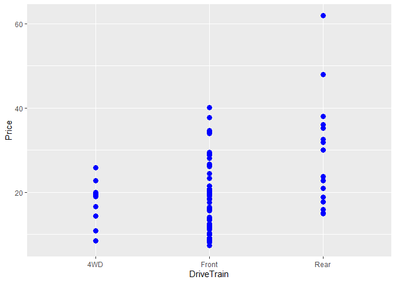<!-- -->

5 - Há uma relação entre o maior preço para os caros automáticos com
tração traseira?

``` r
qplot(data=Cars93, x= DriveTrain, y= Price, colour=Man.trans.avail, size=I(3))
```

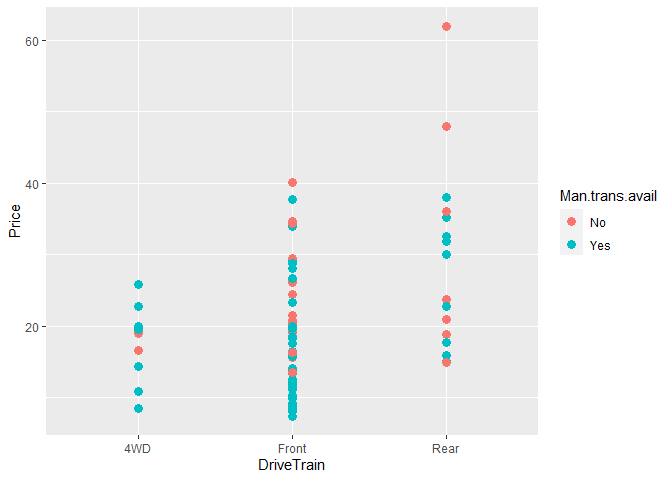<!-- -->

6 - Qual a relação entre o preço dos carros com a potência?

``` r
plt1 <- ggplot(data = Cars93, aes(x=Price, y=Horsepower))

plt1 + geom_point() + xlab('Preço')
```

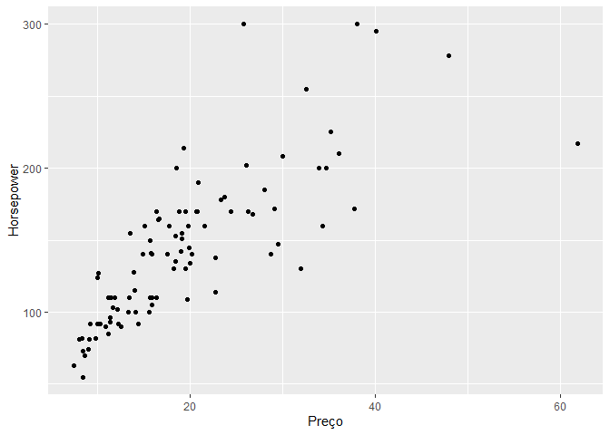<!-- -->
aes = Aesthetics. Possui como atributo os valores dos eixos x e y,
Colour, size, shape.

colour = quais conjunto dados usar para colorir. size= quais conjunto e
dados usar para controlar o tamanho dos pontos de dados. shape = quais
conjunto dados usar para distinguir o formato dos pontos de dados.

É possível inferir a partir dos dados, que carros com mais cavalos de
potência são mais caros.

## Diferença entre estética e atributos em ggplot2

A estética é definida dentro de aes() na sintaxe do ggplot e os
atributos estão fora de aes().

Por exemplo: ggplot (dados, aes(x, y, colour = var1) + geom\_point (size
= 6)

Normalmente entendemos a estética como a aparência de algo como, cor,
tamanho etc.

Mas em ggplot, a aparência das coisas é apenas um atributo.

A estética não se refere à aparência de algo, mas à qual variável está
mapeada nele.

## “Mapping” as variáveis horsepower e cylinder

7 - O número de cilindros, influência nos preços e nos cavalos de
potência

``` r
plt2 <- ggplot(data = Cars93, aes(x=Price, y=Horsepower, colour=Cylinders))
plt2 + geom_point()
```

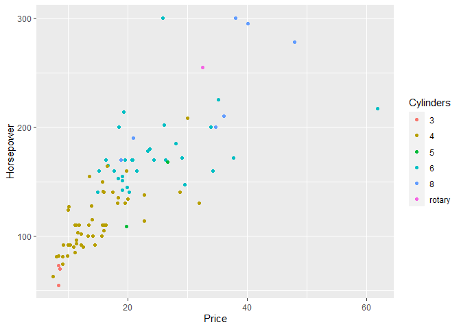<!-- -->

## “Mapping” das variáveis horsepower e cylinder, MPG.highway

8 - Uma maior a potência e um maior número de cilindros, influênciam nos
preços e consumo de combustível?

``` r
plt3 <- ggplot(data = Cars93, aes(x=Price, y=Horsepower, colour=Cylinders, size=MPG.highway))
plt3 + geom_point()
```

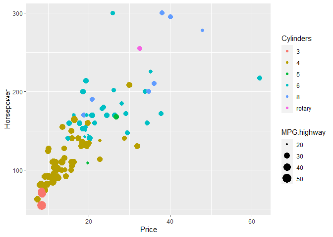<!-- -->

## Setting é diferente de mapping, pois se refere a aparência dos dados, e não ao mapping.

E não mapeando a largura dela para corresponder aos dados, como no
exemplo anterior, onde o tamanho dos cículos correspondem a distância.
Maior distância, maior o tamanho dos círculos.

Neste exemplo, estou atribuindo a largura das linhas = 1.

``` r
plt1 + geom_line(size=1)
```

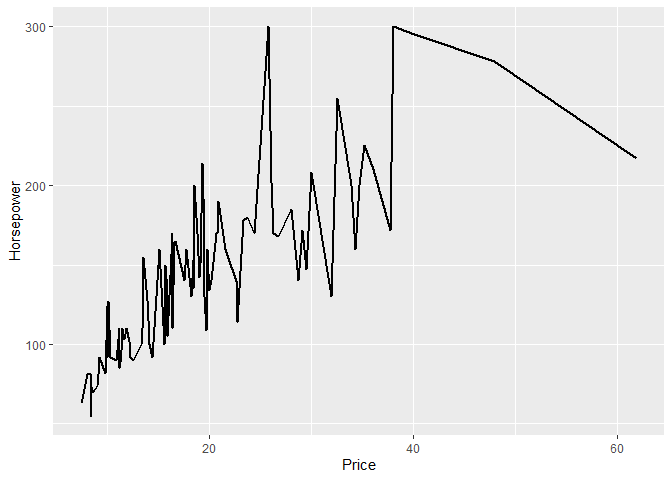<!-- -->

``` r
plt2 + geom_line(size=1)
```

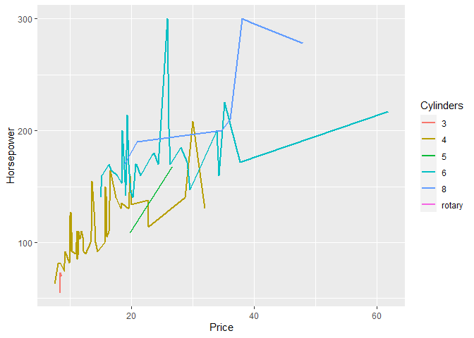<!-- -->

## Multiple plots

Para organizar vários gráficos ggplot2 na mesma página, as funções R
padrão - par() e layout(), não funcionam.

Com isso a solução é usar o pacote gridExtra R, que vem com as função
grid.arrange().

``` r
library(gridExtra)
grid.arrange(plt1 + geom_line(size=1), plt2 + geom_line(size=1), ncol=1)
```

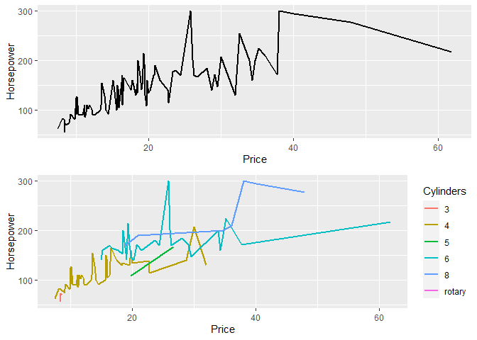<!-- -->

## ggoubr e cowplot

A funções anterior mencionada grid.arrange não alinha os painéis de
plotagem; em vez disso, os gráficos são simplesmente colocados na grade
como estão e, portanto, os eixos não são alinhados.

Caso um alinhamento do eixo dos plots for necessário, o pacote cowplot
inclui a função plot\_grid() com o argumento align.

Já função ggarrange() \[no ggpubr\],também possibilita o alinhamento dos
plots com a função plot\_grid(), e ainda oferece uma solução para
organizar vários ggplots em várias páginas. Ele também pode criar uma
legenda única comum para vários gráficos.

``` r
library(cowplot)
library(ggpubr)
```

    ## 
    ## Attaching package: 'ggpubr'

    ## The following object is masked from 'package:cowplot':
    ## 
    ##     get_legend

Função plot\_grid do pacote cowplot

``` r
plot_grid(plt1 + geom_line(size=1), plt2 + geom_line(size=1), 
          labels = c("A", "B"),
          ncol = 1, nrow = 2)
```

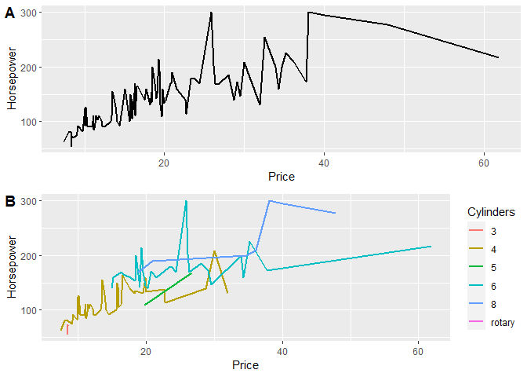<!-- -->

Função ggrange do pacote ggpubr

``` r
ggarrange(plt1 + geom_line(size=1), plt2 + geom_line(size=1),
          labels = c("A", "B"),
          ncol = 1, nrow = 2)
```

<!-- -->

## Anotação do plot com ggpubr

``` r
figure <- ggarrange(plt1 + geom_line(size=1), plt2 + geom_line(size=1) +
                      font("x.text", size = 10),
                    ncol = 1, nrow = 2)

annotate_figure(figure,
                top = text_grob("Visualizing mpg", color = "red", face = "bold", size = 14),
                bottom = text_grob("Data source: \n mtcars data set", color = "blue",
                                   hjust = 1, x = 1, face = "italic", size = 10),
                left = text_grob("Figure arranged using ggpubr", color = "green", rot = 90),
                right = "I'm done, thanks :-)!",
                fig.lab = "Figure 1", fig.lab.face = "bold"
                )
```

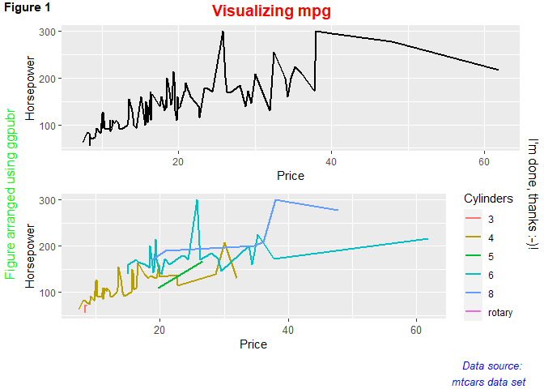<!-- -->

9 - Qual a disdribuição dos preços?
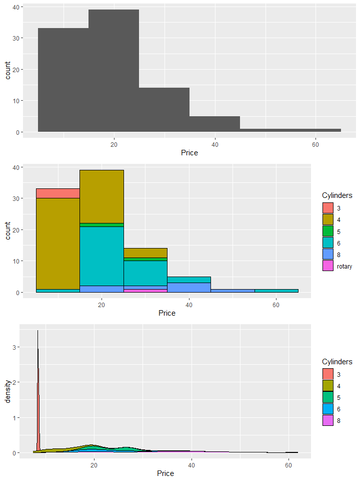<!-- -->

## Geom\_smooth

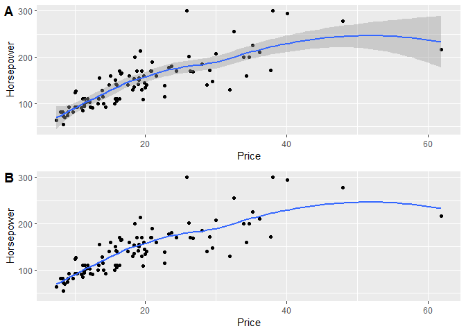<!-- -->

## Facets

``` r
p1 <- pr + geom_histogram(binwidth =10, aes(fill=Cylinders), colour='black') + facet_grid(Cylinders~., scales = 'free')
          
p2 <- plt3 + geom_point() + facet_grid(Cylinders~., scales = 'free')
          
ggarrange(p1, p2 + font("x.text", size = 10),
          ncol = 1, nrow = 2)
```

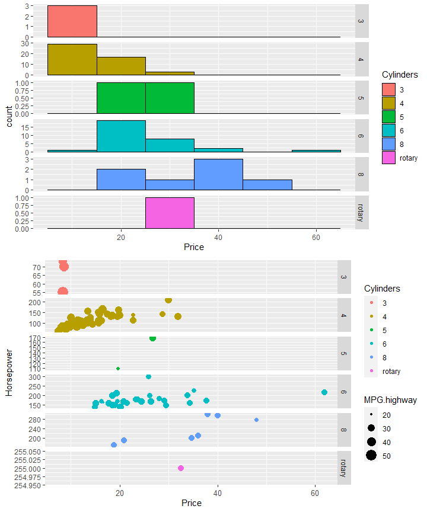<!-- -->

## coordinates

``` r
plt2 + geom_point() + ylim(200,300)
```

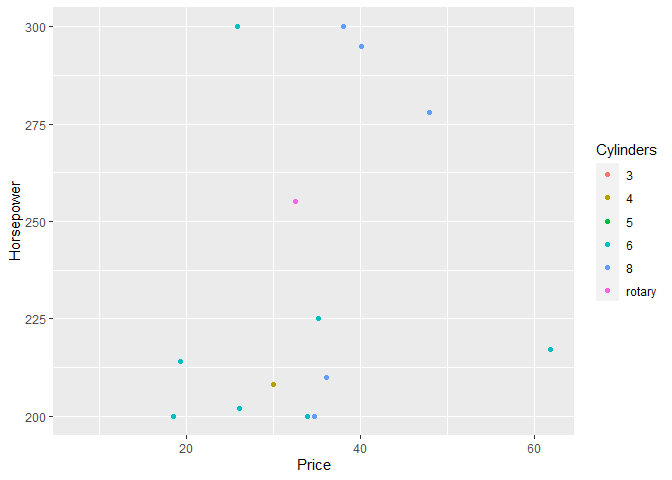<!-- -->

## Zoom nos eixos dos gráficos

``` r
plt2 + geom_point() + coord_cartesian(ylim = c(200,300))
```

<!-- -->

# Themes

Abaixo um plot com os elementos textuais, totalamente fora do padrão de
forma proposital, para facilitar a observação das alterações causada por
cada parâmetro no plot.

``` r
plt_theme <- plt3 + geom_point() 

plt_theme + 
  ggtitle('Distribuição dos preços em relação a potência, cylindros e MPG') + 
  xlab('Potência') +
  ylab('Preço') +
  theme(plot.title = element_text(colour='DarkGreen', size=14, face='bold'),
        axis.title.x = element_text(colour = 'green', size = 18), 
        axis.title.y = element_text(colour = 'blue', size = 20),
        
        # elemento tick
        axis.text.x = element_text(size = 12),
        axis.text.y = element_text(size = 12),
        
        # legendas
        legend.title = element_text(colour = 'black', size = 8),
        legend.text = element_text(size=20))
```

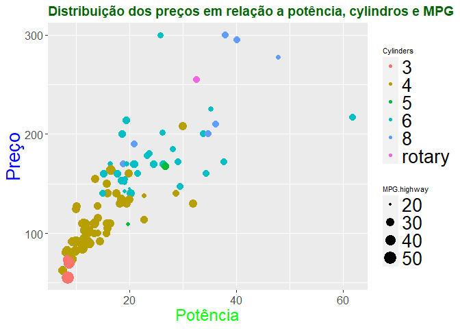<!-- -->

## Referências:

<https://www.r-graph-gallery.com/ggplot2-package.html>
<https://ggplot2.tidyverse.org/reference/ggplot.html>
<https://cran.rstudio.com/web/packages/gridExtra/vignettes/arrangeGrob.html>
<http://www.sthda.com/english/articles/24-ggpubr-publication-ready-plots/81-ggplot2-easy-way-to-mix-multiple-graphs-on-the-same-page/>
<https://r4ds.had.co.nz/index.html>
<https://www.w3schools.com/r/default.asp>
<https://www.cs.upc.edu/~robert/teaching/estadistica/rprogramming.pdf>
